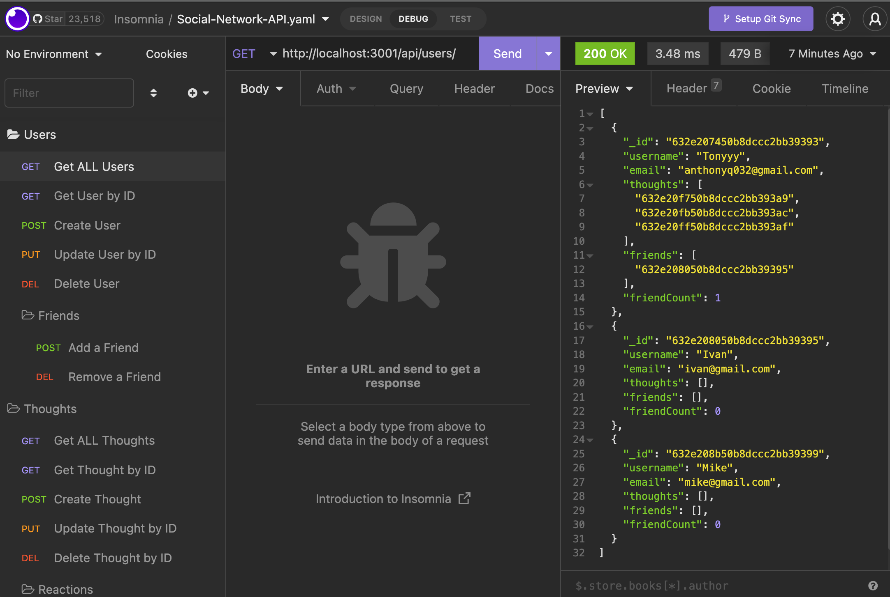
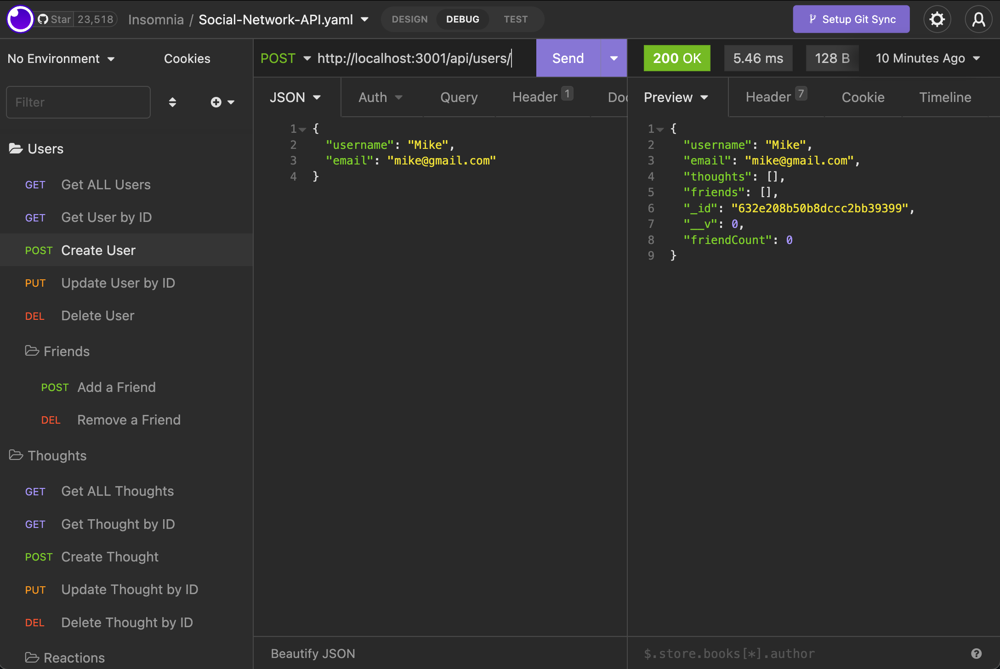
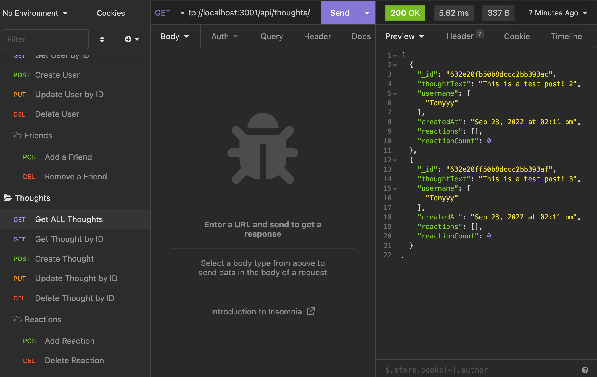
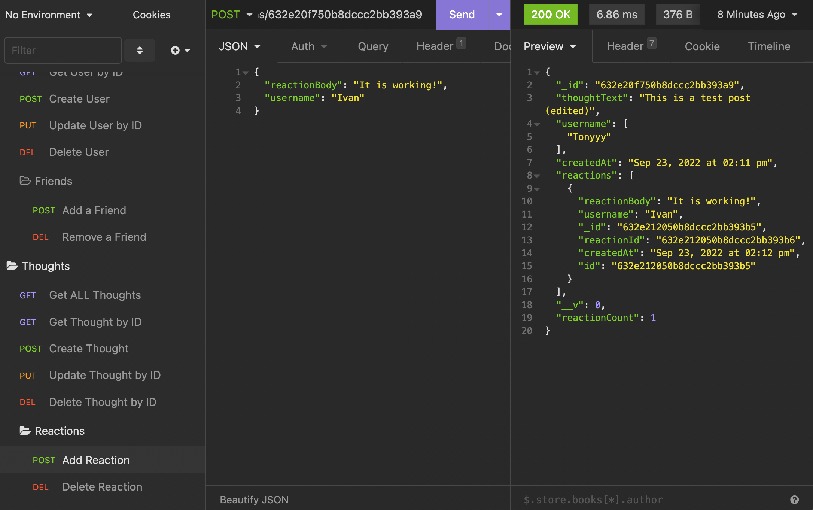

# Social-Network-API

Creating an API for a social network web application where users can share their thoughts, react to friends’ thoughts, and create a friend list.

## Description
The purpose of this project was to build a functional, NoSQL database utilizing MongoDB, Mongoose, and Express. In addition to this I created a functional API that makes requests to this database. With the routes and controllers set up in this repo, users can create usernames, share their thoughts, react to friends’ thoughts, and create a friend list.

Once properly set up and running, the user can utilize their desired API testing tool, such as Insomnia or Postman, to send various HTTP requests to the server, which will modify the MongoDB database.

The user can make GET, POST, PUT, and DELETE requests to modify the database. I have attached a video demonstration for further information. The video is available below or can be accessed by clicking [here.](https://drive.google.com/file/d/1ccHM2lLSTu8I6NJQHosgy9FS_IAcPvXq/view)

## Table of Contents
* [Installation](#installation)
* [Technologies](#technologies)
* [Screenshots](#screenshots)
* [Demonstration](#demonstration)
* [License](#license)
* [Questions](#questions)

## Installation

1. This app is powered by Node.js and MongoDB, because of this, make sure those are properly installed and configured before continuing on.
2. Navigate to the root of this repo and run `npm install` in your console/terminal to download all the necessary npm packages.
3. You are now ready to turn on the server by running `npm start` or `npm run watch` for nodemon (if installed).

*By default, the server is hosted to `http://localhost:3001/` although the PORT number can be modified by changing the value of the variable `PORT` in `server.js` on `line 5`.*

## Technologies
Below is a list of all the technologies we utilized in order to build this project.

* [MongoDB](https://www.mongodb.com)
* [Mongoose](https://mongoosejs.com)
* [Express.js](https://expressjs.com)
* [Moment.js](https://momentjs.com)

## Screenshots

Below are various screenshots of the project running in Insomnia:

Getting all Users:

Creating a User:

Getting all Thoughts:

Adding a Reaction:

## Demonstration

A video demonstration of all the HTTP routes and requests can be accessed by clicking [here](https://drive.google.com/file/d/1ccHM2lLSTu8I6NJQHosgy9FS_IAcPvXq/view).

## License

This project falls under the following license:
* [MIT](https://opensource.org/licenses/MIT)

## Questions
If you have any questions or comments, please feel free to contact me below: 

### Anthony Quinones
Github: [TonyQ032](https://github.com/TonyQ032) 

Email: anthonyq032@gmail.com
